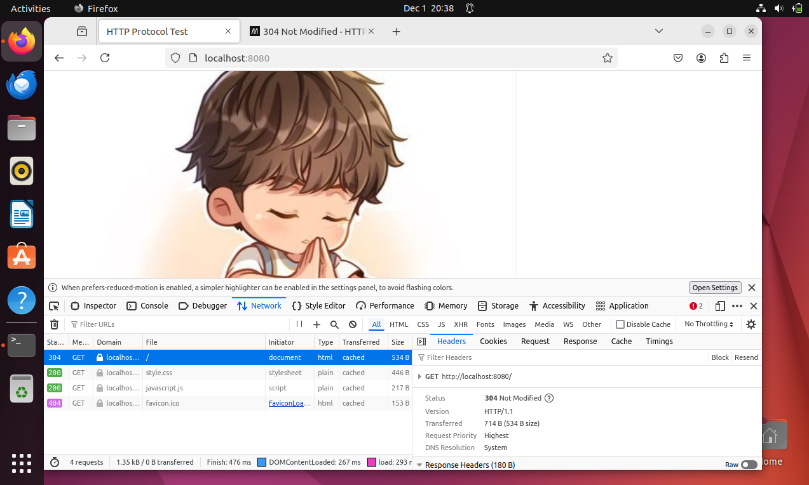
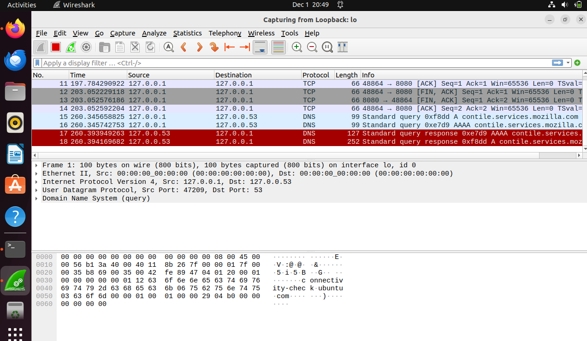
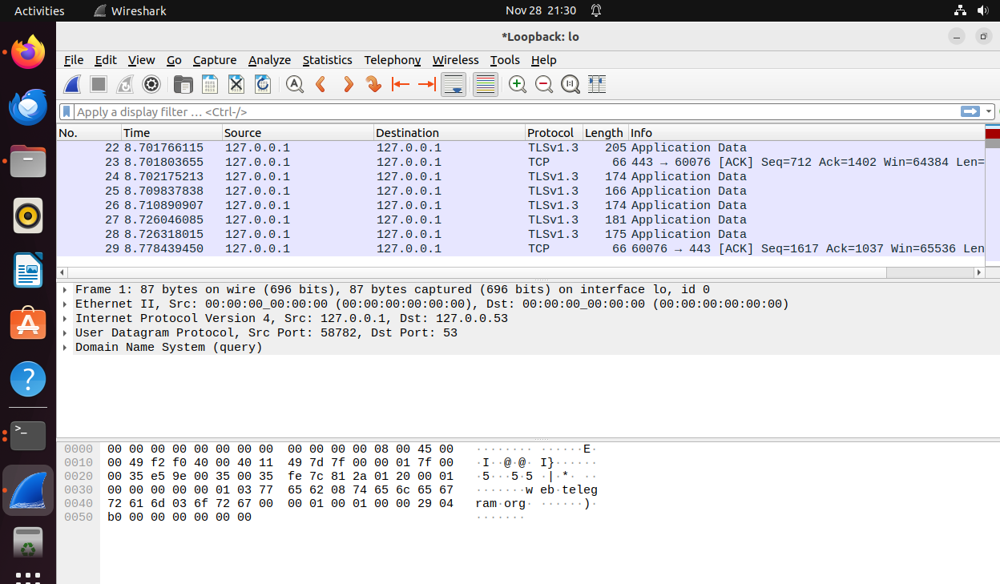
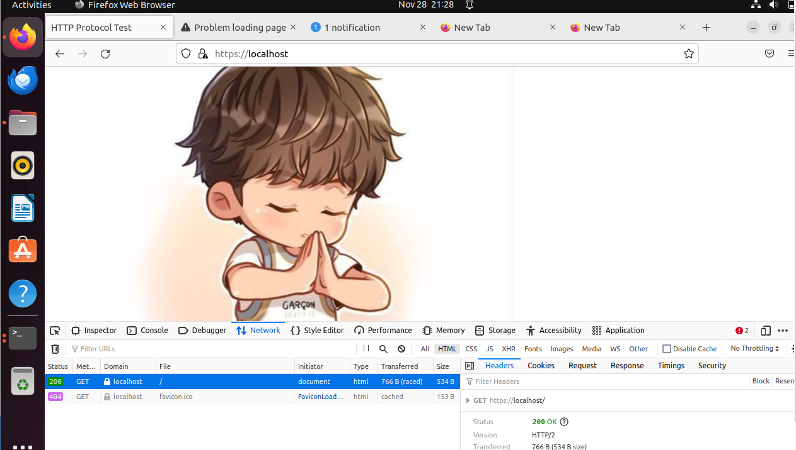

## Komunikasi dan Jaringan Komputer
### Dosen Pengampuh: Dr. Ferry Astika Saputra, ST, M.Sc.

<br>

# 📦 Membuat HTTP/1.1 dan HTTP/2.0 Server Menggunakan Docker dan NGINX
## By: Maulana Bintang Irfansyah - 1224800005

Tugas ini bertujuan untuk membuat server HTTP/1.1 dan HTTP/2.0, dan menggunakan Docker dan NGINX yang dikonfigurasi untuk menyajikan konten statis tanpa SSL, untuk kesederhanaan. Server ini akan mendengarkan pada port 80 DAN 443 dan melayani halaman browser.

---

## 📜 Pendahuluan

Proyek ini bertujuan untuk memberikan pemahaman praktis mengenai cara membuat server HTTP/1.1 dan HTTP/2.0 menggunakan Docker dan NGINX.

---

## 📂 Struktur File

- **`nginx.conf`**: File konfigurasi NGINX yang mengatur server HTTP/1.1.
- **`Dockerfile`**: File untuk membangun image Docker yang berisi server HTTP/1.1 menggunakan NGINX.
- **`site/`**: Folder yang berisi file: index.html, javascript.js, style.css, dan image.jpg.

## 🛠️ Cara Penggunaan

1. **Instal Docker, Wireshark, Chrome**  
   
## 1. Persiapan Aplikasi

- **Docker**: Instal Docker dari [tautan ini](https://www.docker.com/) dan pilih versi yang sesuai dengan sistem operasi Anda. Docker digunakan untuk menjalankan web server dalam container, yang memungkinkan pengujian berbagai versi protokol HTTP secara terisolasi tanpa memengaruhi komponen lainnya.
  
- **Wireshark**: Instal Wireshark dari [tautan ini](https://www.wireshark.org/). Wireshark berfungsi untuk menganalisis lalu lintas jaringan secara real-time.

- **Chrome**: Pastikan aplikasi Chrome terinstal dengan versi terbaru.

## 2. Konfigurasi Docker

Pada bagian ini, kami menggunakan web server **Nginx** karena mendukung penggunaan HTTP/1.1 dan HTTP/2.0. Sebelum mulai konfigurasi, pastikan Docker Engine sudah berjalan.

**a. Unduh Image**

Unduh image web server **Nginx** dari [Docker Hub](https://hub.docker.com/_/nginx) dengan perintah berikut:

```
docker pull nginx:latest
```

**NGINX untuk HTTP/1.1*  

    ```
    events {}

        http {
        server {
            listen 80;
            server_name localhost;

            root /usr/share/nginx/html;
            index index.html;

            location / {
                try_files $uri $uri/ =404;
            }
        }
    }

    ```

**NGINX untuk HTTP/2.0*  
    ```
    events {}

    http {
    server {
        listen 443 ssl http2;
        server_name localhost;

        ssl_certificate /etc/ssl/certs/selfsigned.crt;
        ssl_certificate_key /etc/ssl/private/selfsigned.key;

        root /usr/share/nginx/html;
        index index.html;

        location / {
            try_files $uri $uri/ =404;
        }
    }
}
    ```

3. **Create Container**  
   Container untuk HTTP/1.1 perintah yang dijalankan adalah docker create --name nginx-http1 
   
   docker run -d -p 8080:80 nginx-http1


   Container untuk HTTP/2.0 perintah yang dijalankan adalah docker create --name nginx-http1 

   docker run -d -p 8443:443 nginx-http

---

### 4. Analisis Pengujian Web Server di Google Chrome dan Paket di Wireshark

Jalankan aplikasi Google Chrome, pilih **Inspect Element - Network**.

- **HTTP/1.1**

  Akses URL berikut di Google Chrome: `http://localhost:8080`

  

  Pada tab Network, Anda dapat melihat detail permintaan dan respons yang menggunakan protokol HTTP/1.1.

- **HTTP/2.0**

  Akses URL berikut di Google Chrome: `https://localhost:8443`

  

  Pada tab Network, Anda dapat melihat detail permintaan dan respons yang menggunakan protokol HTTP/2.0.

Jalankan aplikasi Wireshark kemudian pilih Capture Interface yang sesuai, seperti **Adapter for loopback traffic capture**.

- **HTTP/1.1**

  Berikut adalah paket yang ditangkap dari pengujian web server dengan HTTP/1.1:

  

  Pada capture paket Wireshark di atas, protokol yang digunakan adalah TCP. HTTP/1.1 menggunakan koneksi yang persisten dan dapat menangani beberapa permintaan dalam satu koneksi.

- **HTTP/2.0**

  Berikut adalah paket yang ditangkap dari pengujian web server dengan HTTP/2.0:

  

  Pada capture paket Wireshark di atas, terdapat dua protokol yaitu TCP dan TLSv1.3. HTTP/2.0 menggunakan multiplexing untuk mengirimkan beberapa permintaan dan respons secara bersamaan melalui satu koneksi TCP.