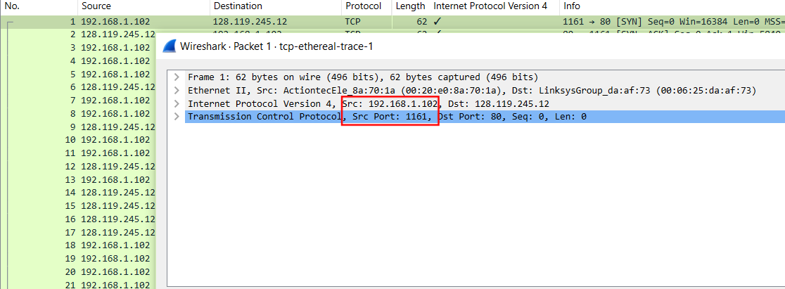
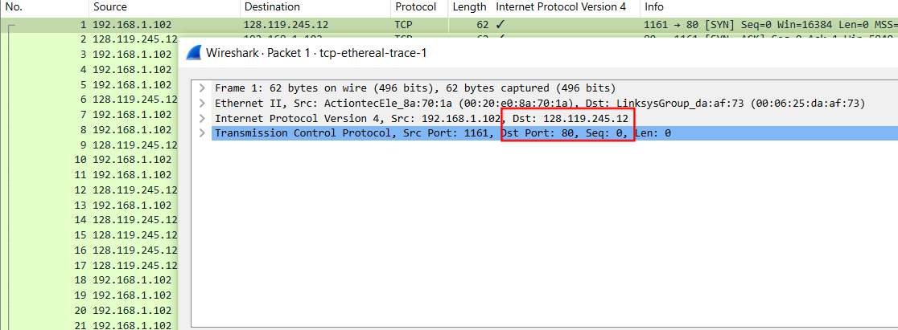
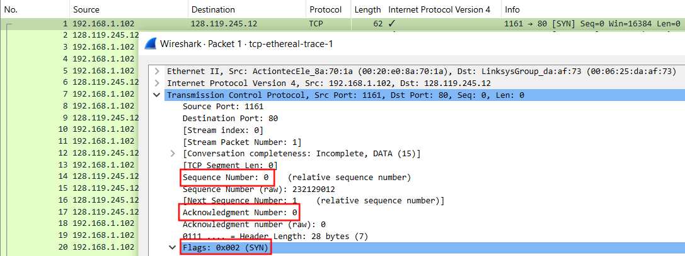
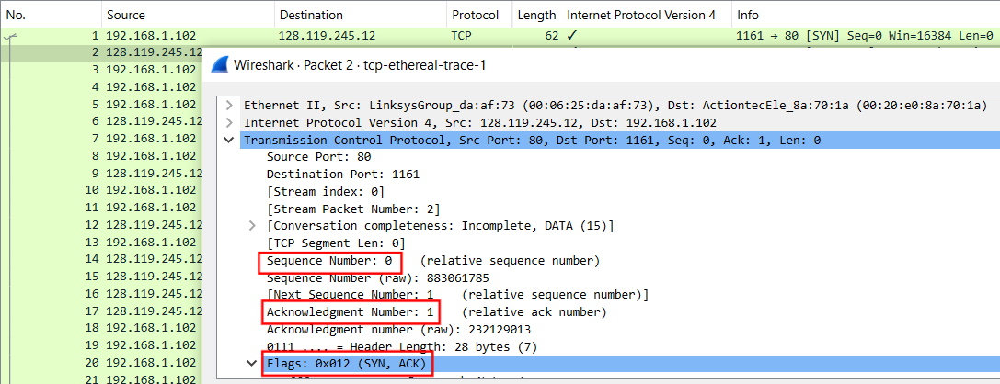
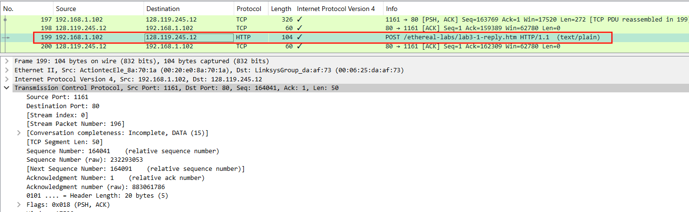
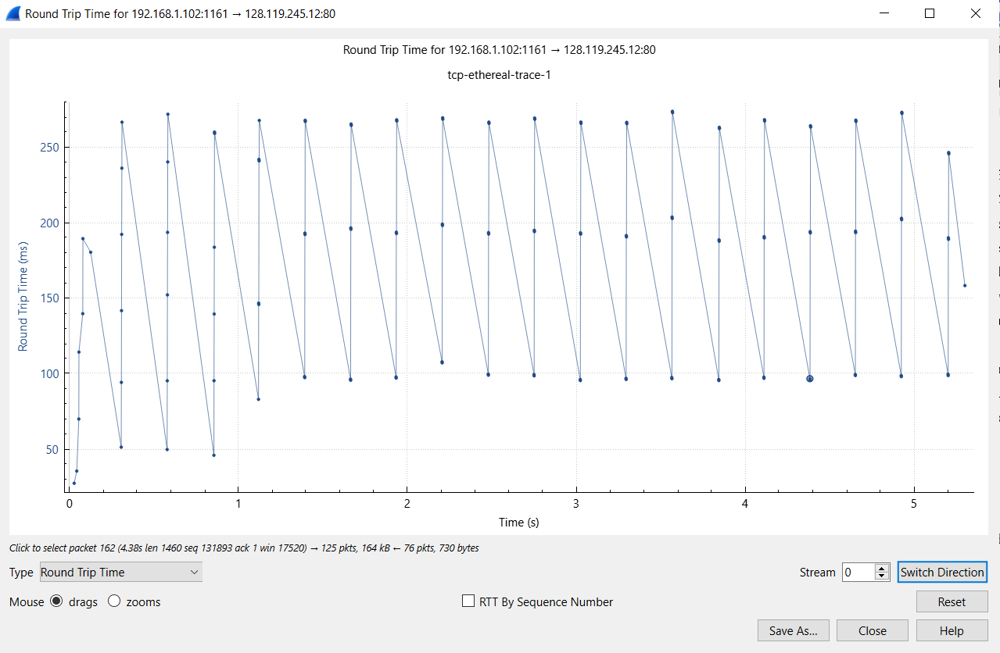
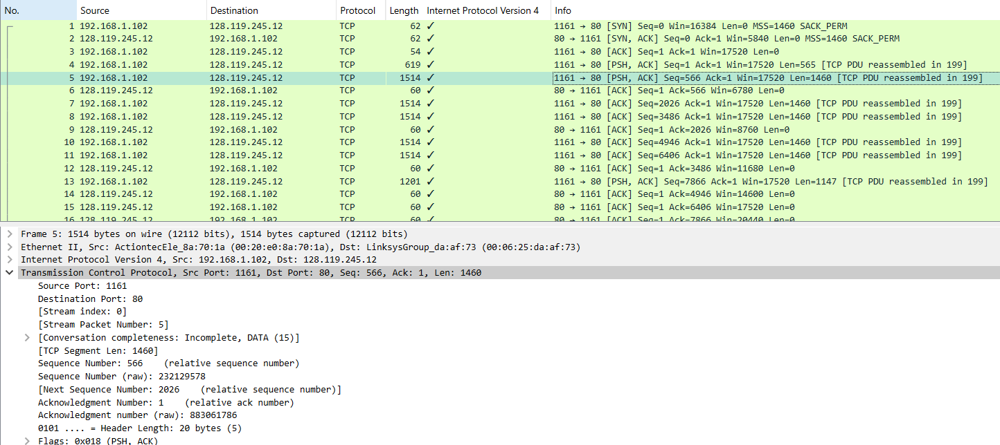

# 📡 TCP Segment Analysis
## By: Maulana Bintang I. - 1224800005

### 📋 Overview
This document describes a TCP segment analysis based on a question related to a file transfer between a client and a server *gaia.cs.umass.edu*. The study uses Wireshark to observe TCP connection details, including **IP Address**, **port number**, **sequence number**, **round trip time (RTT)**, and **segment length**.

---

## 1️⃣ Question and Answer

### 1. **What is the IP address and TCP port number used by your client computer (source) to transfer the file to gaia.cs.umass.edu?**  
**Answer:**  
Figure 1 illustrates the network details of the client-side connection:
- **IP Address:** 192.168.1.102  
- **Port:** 1161  

These values represent the source address and the dynamically allocated ephemeral port used by the client computer for this particular file transfer.

Figure 1. The Networks Details of The Client-Side Connection

---

### 2. **What does gaia.cs.umass.edu use the IP address and port number to receive the file?**  
**Answer:**  
Figure 2 illustrates the network details of the server-side connection:
- **IP Address:** 128.119.245.12  
- **Port:** 80  

This indicates that the server is using the standard HTTP port 80 for sending and receiving TCP segments during this file transfer.

Figure 2. The Networks Details of The Server-Side Connection

---

### 3. **What is the sequence number of the TCP SYN segment that is used to initiate the TCP connection between the client computer and gaia.cs.umass.edu? What is it in the segment that identifies the segment as a SYN segment?**  
**Answer:** 

Figure 3 provides details about the SYN segment:
- **Sequence number of the TCP SYN segment: 0 in the trace** 
- **The SYN flag is set to 1, which clearly identifies the segment as a SYN segment, as this flag indicates the initiation of a new TCP connection.** 

Figure 3. The Sequence Number of The TCP SYN Segment

---

### 4. **What is the sequence number of the SYNACK segment sent by gaia.cs.umass.edu to the client computer in reply to the SYN? What is the value of the ACKnowledgement field in the SYNACK segment? How did gaia.cs.umass.edu determine that value?**  
**Answer:**

Figure 4 explains the SYNACK segment details:
- **Sequence number of the SYNACK segment: 0 in the trace.** 
- **Acknowledgement field value: 1. This value is determined by adding 1 to the sequence number of the SYN segment received from the client.** 
- **The segment is identified as a SYNACK segment because both the SYN and ACK flags are set to 1.** 

This segment serves as the server's response to the client's SYN request, completing the second step of the TCP three-way handshake and acknowledging the client's initial request to establish the connection.
 

Figure 4. The Sequence Number and Acknowledgement Number of The SYNACK Segment

---

### 5. **What is the sequence number of the TCP segment containing the HTTP POST command?**  
**Answer:**  
Figure 5 explains the sequence number of the TCP segment containing the HTTP POST command. The sequence number for the segment is 1.
To locate the POST command, it is necessary to examine the packet content field in the Wireshark window, specifically searching within the DATA field of the segment for the "POST" string. This segment represents the client’s request to upload data to the server, initiating the application layer interaction. The sequence number indicates the starting byte of this data within the overall TCP stream, marking the beginning of the HTTP request transmission.

Figure 5. The Sequence number of the TCP segment containing the HTTP POST command

---

### 6. **What are the sequence numbers, RTT, and Estimated RTT values for the first six TCP connection segments?**  
**Answer:**  
The graph in Figure 6 illustrates the RTT for each segment during the TCP connection. The RTT values, calculated as the time difference between when each segment was sent and when its corresponding ACK was received, show a gradual increase across the segments. Table 1 provides detailed information on the sequence numbers, sending times, ACK received times, RTT values, and Estimated RTT for each segment, allowing for a deeper understanding of the connection dynamics.
 

Table 1. The sending time and the received time of ACKs

| **Segment** | **Seq. Number** | **Sent Time** | **ACK Received** | **RTT (s)** | **Estimated RTT (s)** |
|-------------|-----------------|---------------|------------------|-------------|------------------------|
| 1           | 1               | 0.026477      | 0.053937         | 0.02746     | 0.02746               |
| 2           | 566             | 0.041737      | 0.077294         | 0.035557    | 0.0285                |
| 3           | 2026            | 0.054026      | 0.124085         | 0.070059    | 0.0337                |
| 4           | 3486            | 0.054690      | 0.169118         | 0.11443     | 0.0438                |
| 5           | 4946            | 0.077405      | 0.217299         | 0.13989     | 0.0558                |
| 6           | 6406            | 0.078157      | 0.267802         | 0.18964     | 0.0725                |

- **RTT values are calculated as the difference between the ACK received time and the sent time of each segment.**
- **Estimated RTT is derived using the formula:** EstimatedRTT = 0.875 × Previous EstimatedRTT + 0.125 × SampleRTT

1)  **Segment 1: RTT for Segment 1 = .02746**
2) **Segment 2: 0.875 * 0.02746 + 0.125 * 0.035557 = 0.0285**
3) **Segment 3: 0.875 * 0.0285 + 0.125 * 0.070059 = 0.0337**
4) **Segment 4: 0.875 * 0.0377 + 0.125 * 0.11443 = 0.0438**
5) **Segment 5: 0.875 * 0.0438 + 0.125 * 0.13989 = 0.0558**
6) **Segment 6: 0.875 * 0.0558 + 0.125 * 0.19064 = 0.0725**

These RTT values help measure the latency in the TCP connection and refine the Estimated RTT to improve the TCP flow control for subsequent packets. The increasing RTT values also indicate potential network congestion or increased latency as the transmission progresses.

Figure 6. Round Trip Time (RTT) Graph

The RTT graph provides a visual representation of these values, showing a noticeable upward trend, which could indicate increasing network congestion or other performance bottlenecks. Monitoring such trends is critical for optimizing TCP performance and diagnosing potential issues in the communication path.

---

### 7. **What is the length of each of the first six TCP segments?**  
**Answer:** 

The length of the first TCP segment is 565 bytes, while the subsequent five TCP segments each have a length of 1460 bytes, as shown in Figure 7.
The size variation in the first segment occurs because it includes the HTTP POST request, which often contains headers and data that are smaller than the maximum transmission unit (MTU) size. On the other hand, the remaining segments are filled to the MTU capacity of 1460 bytes for efficiency, which is the maximum payload size allowed before fragmentation.
This pattern reflects the typical behavior of TCP during data transmission:

- **The first segment initiates the payload transfer and may carry smaller data due to its function as the initial request packet.**
- **Subsequent segments maximize the payload to improve throughput and reduce the number of packets sent, adhering to the MTU.**

Figure 7. Lengths of Segments 1–6

This information is crucial in understanding how TCP optimizes network bandwidth utilization while maintaining reliable data delivery. Monitoring segment lengths also provides insight into how data is broken down for transport over the network.

---

### 📈 Conclusion
This analysis provides insight into the TCP workflow, including connection initiation, data segment management, and RTT calculation. These observations help study network performance and TCP flow optimization in real scenarios.

